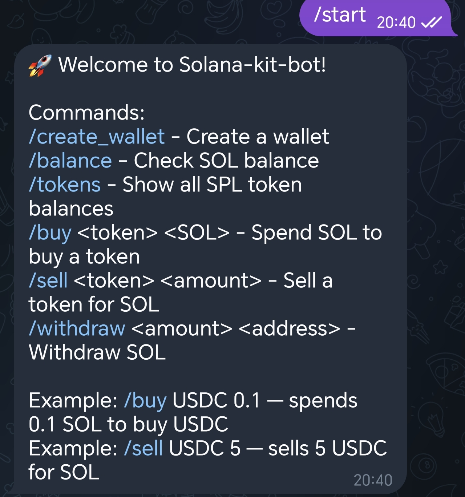
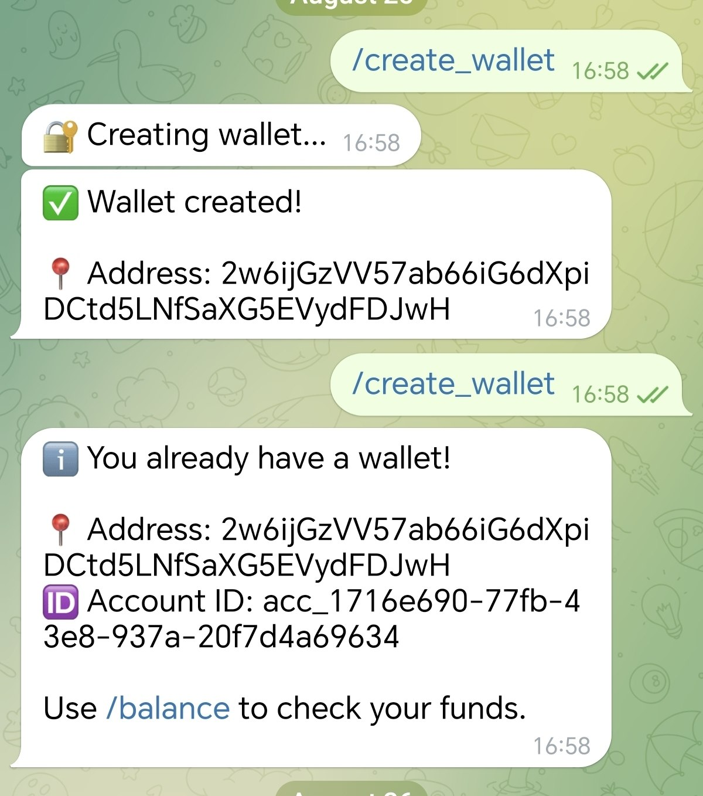
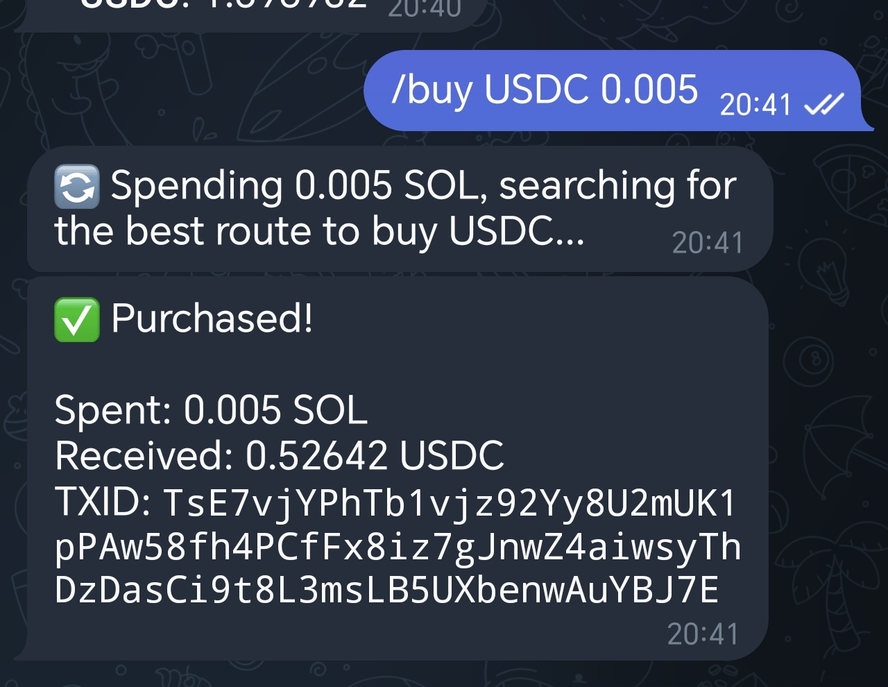
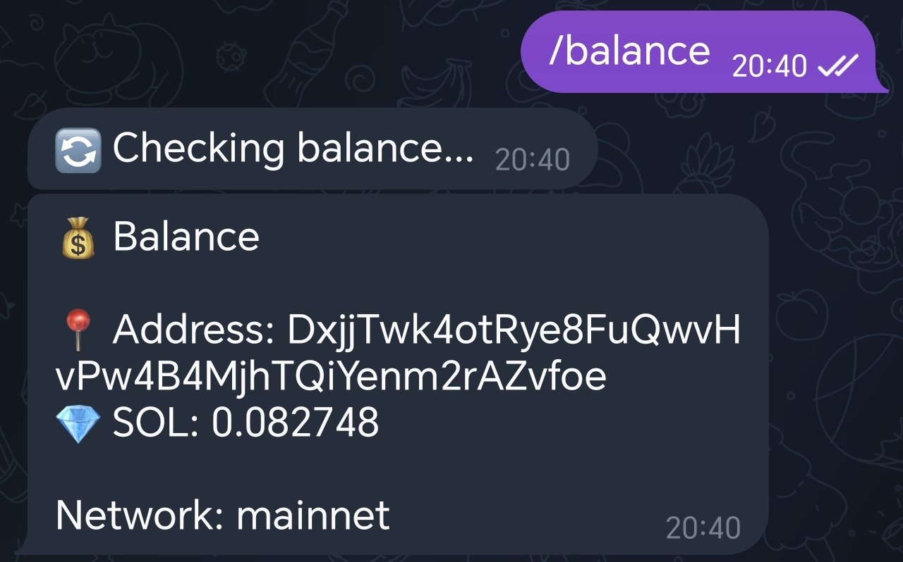
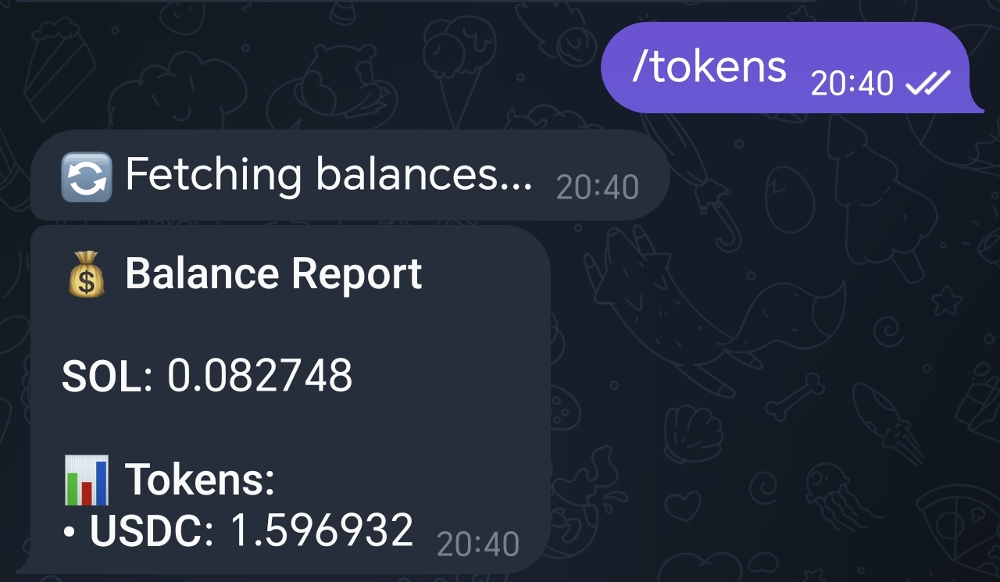

# Solana Starter Kit Bot

A reusable, open-source reference implementation for building Telegram-native Solana applications — without building wallet, signing, swap, and gasless infrastructure from scratch.

[](#license)

[](https://github.com/MrMaksMaksMaks/Starter-kit-bot)

---

## What is it?

Solana Starter Kit Bot is an open-source, working Telegram bot that gives Solana developers a reusable starting point for wallet creation, transaction signing, token swaps, and sponsored (gasless) withdrawals — instead of requiring every new project to build that infrastructure from zero.

Building a Telegram application that talks to Solana normally means integrating wallet infrastructure, secure signing, RPC communication, swap routing, transaction sponsorship, and persistent state before a single feature idea can even be tested. This repository provides a working reference for all of that, built with Rust and Teloxide, using Openfort Backend Wallets for signing, Jupiter for swaps, and Kora for sponsored transactions.

Solana fits this use case specifically because interactions are cheap and fast enough for a conversational, frequent-action UX, Jupiter's liquidity is deep enough that swaps don't need custom routing, and Kora's sponsorship infrastructure lets transaction fees be abstracted away from the end user for supported flows.

---

## What works today

| Feature | Status |
|---|---|
| Telegram bot | ✅ |
| Openfort Backend Wallet creation | ✅ |
| SOL balance | ✅ |
| SPL / Token-2022 balances | ✅ |
| Jupiter swaps (buy/sell) | ✅ Mainnet |
| Kora sponsored (gasless) withdrawals | ✅ |
| Jupiter Referral (optional) | ✅ Mainnet |

> For supported flows, Kora can sponsor transaction fees so the user does not need to hold SOL specifically to pay the network fee.

---

## Live mainnet proof

| Flow | Signature | Explorer |
|---|---|---|
| Buy (SOL → USDC, with referral fee) | `2Sk3FCmNbokLewrauVDoBohUhAMkbcfDqA6iMbsVv9DSnbtPXqAsMkV3zPfziwWL74c5QmW2SvDJKxzegKFXczE1` | [View](https://explorer.solana.com/tx/2Sk3FCmNbokLewrauVDoBohUhAMkbcfDqA6iMbsVv9DSnbtPXqAsMkV3zPfziwWL74c5QmW2SvDJKxzegKFXczE1) |
| Sell (USDC → SOL) | `465yUkJD5FSiQSsDmcan7Qq1VDkkqTcfyATV1mRpezeA5ZXVQM2VCF2qRSatVbBUXRnQEb1yYQ5KH42KN66scWBz` | [View](https://explorer.solana.com/tx/465yUkJD5FSiQSsDmcan7Qq1VDkkqTcfyATV1mRpezeA5ZXVQM2VCF2qRSatVbBUXRnQEb1yYQ5KH42KN66scWBz) |
| Sponsored withdrawal (via Kora) | `27PAXPkFoD97ZBcVemXN3o3B1eMAsdJkmmgFUe9dKGYjE8PkwgNK4JQJNt2HCGMmmMTsoQiHSETUwuJD98yC9x87` | [View](https://explorer.solana.com/tx/27PAXPkFoD97ZBcVemXN3o3B1eMAsdJkmmgFUe9dKGYjE8PkwgNK4JQJNt2HCGMmmMTsoQiHSETUwuJD98yC9x87) |

---

## Demo

| Feature | Screenshot |
|---------|------------|
| **Main Menu** |  |
| **Create Wallet** |  |
| **Buy Tokens** |  |
| **SOL Balance** |  |
| **Token Portfolio** |  |

---

## Wallet architecture

Before the diagrams, a quick note on terminology — the same word ("wallet," "account") gets used loosely across this space, and it's worth being precise once:

| Term | Meaning |
|---|---|
| Telegram user | The application-level identity — a Telegram account interacting with the bot |
| Openfort account | The wallet-infrastructure identity that owns and signs for a Solana wallet |
| Solana wallet | The on-chain address (public key) that holds SOL / SPL tokens |
| SQLite record | The mapping this application stores between a Telegram user and their Openfort account / Solana wallet |

The important security property: the Telegram bot itself does **not** store or directly manage users' private keys. The application stores the mapping above; signing operations are delegated to Openfort's wallet infrastructure.

```text
Telegram User
      │
      ▼
Telegram Bot
      │
      │ wallet/account reference
      ▼
Openfort Backend Wallet
      │
      │ transaction signing
      ▼
Solana
```

**Create wallet flow:**

```text
/create_wallet
      │
      ▼
Rust application
      │
      ▼
Openfort Backend Wallet API
      │
      ▼
Solana wallet/account created
      │
      ▼
Address returned to user, mapping stored in SQLite
```

> **Important:** This repository is an application integration example. Production deployments should independently evaluate their security model, access controls, authentication, rate limiting, transaction policies, and operational key management.

---

## Architecture

```text
┌─────────────────────────────────────────────────────────────────┐
│                         Telegram User                           │
└─────────────────────────────┬───────────────────────────────────┘
                              │
                              ▼
┌─────────────────────────────────────────────────────────────────┐
│                        Telegram Bot API                         │
└─────────────────────────────┬───────────────────────────────────┘
                              │
                              ▼
┌────────────────────────────────────────────────────────────────────┐
│                  Rust / Teloxide Application                       │
│                                                                    │
│  /start  /create_wallet  /balance  /tokens  /buy  /sell  /withdraw │
└───────────────┬───────────────────────┬────────────────────────────┘
                │                       │
                ▼                       ▼
┌─────────────────────────┐   ┌───────────────────────────────────┐
│   Application Modules   │   │       External Infrastructure     │
│                         │   │                                   │
│ balance/                │   │ Openfort Backend Wallets          │
│ config/                 │   │ Jupiter API                       │
│ db/                     │   │ Kora                              │
│ jupiter/                │   │ Solana RPC                        │
│ openfort/               │   │                                   │
│ solana/                 │   └───────────────────────────────────┘
│ withdraw/               │
└────────────┬────────────┘
             │
             ▼
┌─────────────────────────┐
│        SQLite           │
│                         │
│ User ↔ Wallet mapping   │
│ Application state       │
└─────────────────────────┘
```

---

## Transaction flows

### Buy / Sell

```text
Telegram User
      │
      ▼
/buy or /sell
      │
      ▼
Jupiter (/order)
      │
      ▼
Unsigned swap transaction
      │
      ▼
Openfort signs transaction.message bytes
      │
      ▼
Jupiter (/execute)
      │
      ▼
Solana
```

### Withdraw

```text
Telegram User
      │
      ▼
/withdraw
      │
      ▼
Validate destination format + amount
      │
      ▼
Openfort Backend Wallet (user signs)
      │
      ▼
Kora sponsored-transaction flow (fee paid by Kora, not the user)
      │
      ▼
Solana
      │
      ▼
Transaction signature
```

---

## Tech stack

| Technology | Role |
|---|---|
| **Rust** | Application and backend logic |
| **Teloxide** | Telegram Bot framework |
| **Solana SDK** | Solana blockchain interaction |
| **Openfort** | Backend Wallet infrastructure and transaction signing |
| **Jupiter** | Token swap and liquidity aggregation |
| **Kora** | Sponsored (gasless) transaction infrastructure |
| **SQLite** | Persistent local application state |
| **Reqwest** | HTTP communication |
| **Serde** | Serialization and API models |

---

## Quick Start

### Prerequisites

- Rust (stable toolchain)
- A Telegram bot token from [@BotFather](https://t.me/BotFather)
- An Openfort project — secret key, wallet secret, and publishable key
- For swaps: a Solana mainnet RPC endpoint and a small amount of real SOL to test with (Jupiter has no devnet liquidity — see [Known Integration Gotchas](#known-integration-gotchas))

### Installation

```bash
git clone https://github.com/MrMaksMaksMaks/Starter-kit-bot.git
cd Starter-kit-bot
cargo build --release
```

### Configuration

```bash
cp .env.example .env
```

Fill in the required variables — see [Configuration](#configuration) below for the full list.

Do not commit your `.env` file.

### First commands

```bash
cargo run
```

Then, in Telegram:

1. `/start` — see available commands
2. `/create_wallet` — creates a Solana wallet via Openfort
3. `/balance` — confirms the wallet is live and readable
4. `/buy USDC 0.01` — a small real swap on mainnet, once the wallet is funded

---

## Configuration

| Variable | Required | Description |
|---|---|---|
| `TELEGRAM_BOT_TOKEN` | Yes | Token from [@BotFather](https://t.me/BotFather) |
| `OPENFORT_SECRET_KEY` | Yes | Openfort project secret key (`sk_...`) |
| `OPENFORT_WALLET_SECRET` | Yes | Openfort wallet secret used to sign `X-Wallet-Auth` JWTs |
| `OPENFORT_PUBLISHABLE_KEY` | Yes | Openfort publishable key — used for Kora gasless RPC calls |
| `OPENFORT_BASE_URL` | No (default: `https://api.openfort.io`) | Openfort API base URL |
| `SOLANA_RPC_URL` | Yes | Solana RPC endpoint. Use a devnet URL for wallet/balance testing, mainnet for swaps |
| `SOLANA_NETWORK` | Yes | `devnet` or `mainnet` — used for explorer links and cluster context |
| `DATABASE_URL` | No (default: `sqlite:./data/bot.db`) | SQLite connection string |
| `JUPITER_API_KEY` | No | Jupiter API key, if you have one |
| `REFERRAL_FEE_BPS` | No (default: `50`) | Swap fee in basis points routed to your referral account |
| `REFERRAL_ACCOUNT` | No | Your Jupiter Referral account address — must be initialized under the Ultra project (see [Known Integration Gotchas](#known-integration-gotchas)) |

---

## Jupiter Referral / Monetization

This starter kit includes an optional integration with Jupiter's Referral mechanism, confirmed working on mainnet (see [Live mainnet proof](#live-mainnet-proof)).

It is disabled by simply omitting `REFERRAL_ACCOUNT` from `.env` — the core wallet, swap, and withdrawal infrastructure works identically with or without it.

The integration exists to demonstrate one way a developer could add a transparent revenue mechanism on top of the reusable infrastructure, without taking custody of user funds — not as the primary purpose of the repository. The default configuration routes 50 bps (0.5%) of each swap to a referral account via Jupiter's `referralAccount` / `referralFee` parameters.

Developers using this repository as a foundation can remove or replace this configuration entirely.

---

## Security

Security is a core design consideration of the project, and an area of active, ongoing work.
The starter kit is designed to demonstrate a safer architecture for Telegram-native Solana applications, while being explicit about the security boundaries of the current implementation.

### Current security model

The Telegram bot does not store users' private keys in SQLite or in the application source code. Transaction signing is delegated to Openfort Backend Wallet infrastructure. Each signing request is authenticated with a freshly generated JWT (a unique jti per request), which prevents replay of the same authentication request against the Openfort API. The application stores the mapping between the Telegram user and the corresponding Openfort account / Solana wallet.

Sensitive application credentials are provided through environment variables and must never be committed to the repository.

### Current limitations

This repository is a working starter kit, not a fully hardened production system.

Known limitations in the current implementation include:

- withdrawals execute immediately without a confirmation step;
- withdrawal limits are not currently enforced;
- there is no dedicated transaction history;
- Telegram command rate limiting is not currently implemented;
- replay protection at the Solana transaction level (preventing the same swap or withdrawal from being submitted twice) beyond Solana's own blockhash expiry is not implemented — this is distinct from Openfort API request replay, which is already mitigated via per-request JWT nonces;
- transactions are not simulated before signing;
- secrets are currently provided via environment variables only; integration with a dedicated secret manager (e.g. AWS Secrets Manager, Google Secret Manager, HashiCorp Vault) for production deployments is not yet implemented.

These limitations are intentionally documented so developers can clearly understand what the reference implementation does today and what still needs to be hardened before exposing it to real users with meaningful funds.

### Planned security hardening

The roadmap focuses on a defined set of security improvements:

- withdrawal confirmation and configurable withdrawal limits;
- address validation;
- rate limiting reference implementation;
- replay / duplicate-action protection;
- transaction simulation before signing;
- structured transaction and security logging;
- independently verified account recovery with anti-takeover safeguards;
- independent security review and remediation of critical or high-risk findings;
- wallet secret rotation policy for the Openfort signing key, leveraging Openfort's built-in rotation endpoint;
- reference integration with a platform secret manager (AWS Secrets Manager, Google Secret Manager, or HashiCorp Vault) for production secret storage.

The goal is not to claim that the starter kit becomes universally "production secure". Instead, the project will provide a significantly stronger and better-documented security baseline that developers can evaluate and extend for their own applications.

---

## Known Integration Gotchas

Real integration pitfalls discovered while building this project. Documenting them here is meant to save the next developer the debugging time it took to find them.

- **Jupiter API is mainnet-only.** There is no Jupiter liquidity on devnet. Wallet creation, balance checks, and withdrawals work fine on devnet, but `/buy` and `/sell` will not find a route — test swaps on mainnet with small amounts.
- **Only `ExactIn` swap mode is supported.** The `/swap/v2/order` endpoint used here does not support `ExactOut`. You can specify "spend exactly this much," not "receive exactly this much."
- **Sign the transaction's *message*, not the full serialized transaction.** When delegating signing to Openfort's backend wallet `/sign` endpoint, hash and send `transaction.message.serialize()` — not `bincode::serialize(&transaction)`. Signing the wrong payload produces a signature that silently fails on-chain verification.
- **Openfort's REST API structure is not always what the public docs suggest, and v1/v2 endpoints differ.** Field names for the same conceptual operation (e.g. `player` vs `user`, snake_case vs camelCase claims, hex vs base64 payload encoding) have changed between API versions. Cross-check against the actual SDK source (`openapi-client/generated/`) rather than relying solely on public documentation.
- **The Jupiter Referral account must be initialized under the correct on-chain "project."** Creating a referral account through the web dashboard may register it under the wrong project for the Meta-Aggregator (`/order` + `/execute`) API. Use `@jup-ag/referral-sdk` with `projectPubKey = DkiqsTrw1u1bYFumumC7sCG2S8K25qc2vemJFHyW2wJc` (Jupiter Ultra Referral Project) if a dashboard-created account is rejected with "Invalid referralAccount" or a project mismatch error.

---

## Roadmap

Scope is intentionally focused.

This open-source repository is intended to become a more secure, reusable foundation for Telegram-native Solana applications — not a full-featured trading platform.

The roadmap focuses on hardening the existing working implementation, improving developer experience, documenting production considerations, and independently reviewing the security-critical parts of the system.

### Core

- [ ] Withdrawal confirmation step
- [ ] Configurable withdrawal limits
- [ ] Transaction history
- [ ] Account recovery after Telegram ID change using an independently verified recovery factor and anti-takeover protections
- [ ] Support for additional SPL tokens with independently verified decimals
- [ ] Token metadata and logos

### Security & Reliability

- [ ] Rate limiting reference implementation
- [ ] Replay / duplicate-action protection
- [ ] Address validation
- [ ] Transaction simulation before signing
- [ ] Structured transaction and security logging
- [ ] Independent security review
- [ ] Remediation of critical and high-risk findings identified during the review
- [ ] Wallet secret rotation policy (leveraging Openfort's rotation endpoint)
- [ ] Reference integration with a platform secret manager for production secret storage

### Developer Experience

- [ ] Core integration tests
- [ ] Inline keyboard UI for confirmation and common actions
- [ ] Production deployment guide

### Trading

Advanced trading features — including limit orders, DCA, token sniping, and copy trading — are intentionally out of scope for this open-source starter kit.

These features require substantially more complex execution, security, reliability, and abuse-prevention mechanisms than the core wallet, swap, and withdrawal infrastructure demonstrated here.

They may be developed separately as a commercial product built on top of this open-source foundation and are not part of the funded roadmap for this repository.

---

## Reusability

The project is released as open source so other developers can inspect the implementation, reuse it, and build on top of it.

The same infrastructure can support other kinds of Telegram-native Solana applications, not just this specific bot — for example:

- a community bot;
- a DeFi interface;
- a payment bot;
- a portfolio assistant;
- a game economy;
- or another Telegram-native Solana application.

The wallet integration, transaction signing, swap, and withdrawal logic is the same across all of these use cases.

---

## Contributing

Contributions, bug reports, and improvements are welcome.

```bash
git checkout -b feature/my-feature
cargo fmt
cargo check
git commit -m "Add my feature"
git push origin feature/my-feature
```

Then open a Pull Request.

---

## License

MIT License.

Copyright © 2026.

---

## Author

Built by **MAKSIM GORBUNOV**

Questions, feedback, or collaboration: jobpostgm@gmail.com

---

## 🇷🇺 Русский

## Что это за проект?

Solana Starter Kit Bot — открытый, рабочий Telegram-бот, который даёт Solana-разработчикам переиспользуемую основу для создания кошельков, подписи транзакций, обмена токенов и спонсируемого (gasless) вывода средств — вместо того чтобы каждый новый проект строил эту инфраструктуру с нуля.

Создание Telegram-приложения, взаимодействующего с Solana, обычно означает интеграцию нескольких компонентов: инфраструктуры кошельков, безопасной подписи, RPC-коммуникации, обмена токенов, спонсирования транзакций и хранения состояния — и всё это ещё до того, как можно проверить саму идею продукта. Этот репозиторий даёт рабочую реализацию всего этого, написанную на Rust с использованием Teloxide, Openfort Backend Wallets для подписи, Jupiter для обмена токенов и Kora для спонсируемых транзакций.

Solana хорошо подходит именно для такого сценария: транзакции достаточно дешёвые и быстрые для частого взаимодействия, ликвидность Jupiter достаточно глубокая, чтобы не писать собственную маршрутизацию, а инфраструктура спонсирования Kora позволяет скрыть управление комиссией от конечного пользователя.

## Что работает уже сейчас

| Возможность | Статус |
|---|---|
| Telegram-бот | ☑ |
| Создание Openfort Backend Wallet | ☑ |
| Баланс SOL | ☑ |
| Балансы SPL / Token-2022 | ☑ |
| Jupiter свопы (покупка/продажа) | ☑ **Mainnet** |
| Спонсируемый (gasless) вывод через Kora | ☑ |
| Jupiter Referral (опционально) | ☑ **Mainnet** |

Для поддерживаемых сценариев (например, вывод средств) комиссия сети оплачивается через Kora — пользователю не нужно держать SOL для оплаты газа.

## Подтверждение работы в Mainnet

| Операция | Подпись транзакции | Explorer |
|---|---|---|
| Покупка (SOL → USDC, с реферальной комиссией) | `2Sk3FcMnbokLewrauVDobohUhAMkbcFdqA6iMbsvV9DsnbtPXqAsMkV3zPfzixwL74c5QmW2SvDJKxzegKFXczE1` | [Открыть](https://explorer.solana.com/tx/2Sk3FcMnbokLewrauVDobohUhAMkbcFdqA6iMbsvV9DsnbtPXqAsMkV3zPfzixwL74c5QmW2SvDJKxzegKFXczE1?cluster=mainnet) |
| Продажа (USDC → SOL) | `465yUk3D5FS1QSsDmcAn7Qq1VDkkqTcfyATV1mRpezeA5ZXVQM2VCF2qRSatVbBUXRnQeB1yYQ5KH42KN66sCwBz` | [Открыть](https://explorer.solana.com/tx/465yUk3D5FS1QSsDmcAn7Qq1VDkkqTcfyATV1mRpezeA5ZXVQM2VCF2qRSatVbBUXRnQeB1yYQ5KH42KN66sCwBz?cluster=mainnet) |
| Спонсируемый вывод (через Kora) | `27PAXPkFoD97ZBcVemXN3o3B1eMaSdJkmmgFUe9dKGYjE8PkwgNK4JQJNt2HCGmmMTsOqIHSETUwuJD98yC9x87` | [Открыть](https://explorer.solana.com/tx/27PAXPkFoD97ZBcVemXN3o3B1eMaSdJkmmgFUe9dKGYjE8PkwgNK4JQJNt2HCGmmMTsOqIHSETUwuJD98yC9x87?cluster=mainnet) |

## Демо

| Функция | Скриншот |
|---|---|
| **Главное меню** | `Welcome to Solana-kit-bot!\nCommands:\n/create_wallet - Create a wallet\n/balance - Check SOL balance\n/tokens - Show all SPL token balances\n/buy <token> <SOL> - Spend SOL to buy a token\n/sell <token> <amount> - Sell a token for SOL\n/withdraw <amount> <address> - Withdraw SOL\nExample: /buy USDC 0.1 - spends 0.1 SOL to buy USDC\nExample: /sell USDC 5 - sells 5 USDC for SOL` |
| **Создание кошелька** | `/create_wallet` → `Creating wallet...` → `Wallet created! Address: 2w6ijGzVV57ab66iG6dXpiDCtd5LNFsAxG5EVydFDJwH` |
| **Покупка токена** | `/buy USDC 0.005` → `Spending 0.005 SOL, searching for the best route to buy USDC...` → `Purchased! Spent: 0.005 SOL, Received: 0.52642 USDC, TXID: ...` |

## Архитектура кошелька

Прежде чем перейти к схемам, стоит уточнить терминологию — слово «кошелёк» и «аккаунт» используется в разных смыслах:

| Термин | Значение |
|---|---|
| **Пользователь Telegram** | Идентификатор на уровне приложения — аккаунт в Telegram, взаимодействующий с ботом |
| **Аккаунт Openfort** | Идентификатор в инфраструктуре кошелька, который владеет и подписывает транзакции для Solana-кошелька |
| **Solana-кошелёк** | Ончейн-адрес (публичный ключ), на котором хранятся SOL / SPL-токены |
| **Запись в SQLite** | Связка, которую это приложение хранит между пользователем Telegram и его аккаунтом Openfort / Solana-кошельком |

**Важное свойство безопасности:** Telegram-бот сам **не хранит и напрямую не управляет приватными ключами пользователей**. Приложение хранит только связку, а операции подписи делегируются инфраструктуре Openfort.

```text
Пользователь Telegram
        │
        ▼
Telegram Bot
        │
        │ ссылка на wallet/account
        ▼
Openfort Backend Wallet
        │
        │ подпись транзакции
        ▼
Solana
```
## Architecture

```text
┌─────────────────────────────────────────────────────────────────┐
│                         Telegram User                           │
└─────────────────────────────┬───────────────────────────────────┘
                              │
                              ▼
┌─────────────────────────────────────────────────────────────────┐
│                        Telegram Bot API                         │
└─────────────────────────────┬───────────────────────────────────┘
                              │
                              ▼
┌────────────────────────────────────────────────────────────────────┐
│                  Rust / Teloxide Application                       │
│                                                                    │
│  /start  /create_wallet  /balance  /tokens  /buy  /sell  /withdraw │
└───────────────┬───────────────────────┬────────────────────────────┘
                │                       │
                ▼                       ▼
┌─────────────────────────┐   ┌───────────────────────────────────┐
│   Application Modules   │   │       External Infrastructure     │
│                         │   │                                   │
│ balance/                │   │ Openfort Backend Wallets          │
│ config/                 │   │ Jupiter API                       │
│ db/                     │   │ Kora                              │
│ jupiter/                │   │ Solana RPC                        │
│ openfort/               │   │                                   │
│ solana/                 │   └───────────────────────────────────┘
│ withdraw/               │
└────────────┬────────────┘
             │
             ▼
┌─────────────────────────┐
│        SQLite           │
│                         │
│ User ↔ Wallet mapping   │
│ Application state       │
└─────────────────────────┘
```
---

## Основные потоки транзакций

**Создание кошелька:**

```text
/create_wallet
      │
      ▼
Rust-приложение
      │
      ▼
Openfort Backend Wallet API
      │
      ▼
Solana wallet/account создан
      │
      ▼
Адрес возвращён пользователю, связка сохранена в SQLite
```

**Покупка / Продажа (своп)**

```text
Telegram User
      │
      ▼
/buy or /sell
      │
      ▼
Jupiter (/order)
      │
      ▼
Unsigned swap transaction
      │
      ▼
Openfort signs transaction.message bytes
      │
      ▼
Jupiter (/execute)
      │
      ▼
Solana
```
**Вывод SOL**

```text
Telegram User
      │
      ▼
/withdraw
      │
      ▼
Validate destination format + amount
      │
      ▼
Openfort Backend Wallet (user signs)
      │
      ▼
Kora sponsored-transaction flow (fee paid by Kora, not the user)
      │
      ▼
Solana
      │
      ▼
Transaction signature
```

---
> **Важно:** этот репозиторий является примером интеграции. Перед production-развёртыванием необходимо отдельно оценить модель безопасности, контроль доступа, аутентификацию, ограничение частоты запросов (rate limiting), политики транзакций и управление ключевой инфраструктурой.

---

## Технологический стек

| Технология | Роль |
|---|---|
| **Rust** | Логика приложения и бэкенд |
| **Teloxide** | Фреймворк для Telegram-бота |
| **Solana SDK** | Взаимодействие с блокчейном Solana |
| **Openfort** | Инфраструктура Backend Wallet и подпись транзакций |
| **Jupiter** | Обмен токенов и агрегация ликвидности |
| **Kora** | Инфраструктура спонсируемых (gasless) транзакций |
| **SQLite** | Хранение состояния приложения |
| **Reqwest** | HTTP-коммуникация |
| **Serde** | Сериализация и модели API |

---

## Быстрый старт

### Требования

- Rust (stable toolchain)
- Токен Telegram-бота от [@BotFather](https://t.me/BotFather)
- Проект Openfort — secret key, wallet secret и publishable key
- Для свопов: mainnet RPC-эндпоинт Solana и немного реального SOL для теста (у Jupiter нет ликвидности на devnet — см. «Технические уроки интеграции»)

### Установка

```bash
git clone https://github.com/MrMaksMaksMaks/Starter-kit-bot.git
cd Starter-kit-bot
cargo build --release
```

### Настройка

```bash
cp .env.example .env
```

Заполните переменные — полный список см. в разделе «Конфигурация» ниже. Не добавляйте `.env` в Git.

### Первые команды

```bash
cargo run
```

Дальше в Telegram:

1. `/start` — список доступных команд
2. `/create_wallet` — создаёт Solana-кошелёк через Openfort
3. `/balance` — подтверждает, что кошелёк создан и читается
4. `/buy USDC 0.01` — небольшой реальный своп в мейннете, после пополнения кошелька

---

## Конфигурация

| Переменная | Обязательна | Описание |
|---|---|---|
| `TELEGRAM_BOT_TOKEN` | Да | Токен от @BotFather |
| `OPENFORT_SECRET_KEY` | Да | Секретный ключ проекта Openfort (`sk_...`) |
| `OPENFORT_WALLET_SECRET` | Да | Wallet secret Openfort для подписи x-wallet-Auth JWT |
| `OPENFORT_PUBLISHABLE_KEY` | Да | Publishable key Openfort — нужен для gasless-вызовов через Kora |
| `OPENFORT_BASE_URL` | Нет (по умолчанию `https://api.openfort.io`) | Базовый URL API Openfort |
| `SOLANA_RPC_URL` | Да | RPC-эндпоинт Solana. Devnet — для тестов кошелька/баланса, mainnet — для свопов |
| `SOLANA_NETWORK` | Да | `devnet` или `mainnet` |
| `DATABASE_URL` | Нет (по умолчанию `sqlite:./data/bot.db`) | Строка подключения SQLite |
| `JUPITER_API_KEY` | Нет | API-ключ Jupiter, если есть |
| `REFERRAL_FEE_BPS` | Нет (по умолчанию `50`) | Комиссия свопа в bps на твой реферальный аккаунт |
| `REFERRAL_ACCOUNT` | Нет | Твой реферальный аккаунт Jupiter — должен быть инициализирован под Ultra-проектом (см. «Технические сложности интеграции») |

---

## Jupiter Referral / Монетизация

Стартер-кит включает опциональную интеграцию с реферальным механизмом Jupiter, подтверждённую работающей в мейннете (см. «Подтверждение работы в Mainnet»).

Отключается простым отсутствием `REFERRAL_ACCOUNT` в `.env` — базовая инфраструктура кошелька, свопов и вывода работает идентично с ней и без неё.

Интеграция существует, чтобы показать один из способов добавить прозрачный источник дохода поверх переиспользуемой инфраструктуры, не беря на себя кастодию средств пользователя — а не как основную цель репозитория. Дефолтная конфигурация направляет 50 bps (0,5%) с каждого свопа на реферальный аккаунт через параметры Jupiter `referralAccount` / `referralFee`.

Разработчики, использующие репозиторий как основу, могут убрать или заменить эту конфигурацию полностью.

## Безопасность

Безопасность — ключевая часть проекта и область постоянной, активной работы. Стартер-кит спроектирован для демонстрации безопасной архитектуры для Telegram-приложений на Solana, при этом чётко обозначены границы безопасности текущей реализации.

### Текущая модель безопасности

Telegram-бот **не хранит приватные ключи пользователей** в SQLite или в исходном коде приложения. Подпись транзакций делегируется инфраструктуре **Openfort Backend Wallet**. Приложение хранит только связку между Telegram-пользователем и соответствующим Openfort-аккаунтом / Solana-кошельком.

Чувствительные учётные данные приложения передаются через переменные окружения и никогда не должны попадать в репозиторий.

### Текущие ограничения

Этот репозиторий — рабочий стартер-кит, а не полностью защищённая production-система.

Известные ограничения в текущей реализации включают:

- вывод средств выполняется мгновенно, без шага подтверждения;
- лимиты на вывод в настоящее время не применяются;
- отсутствует выделенная история транзакций;
- ограничение частоты запросов (rate limiting) не реализовано;
- защита от повторных транзакций на уровне Solana не реализована (отличается от защиты запросов к Openfort API, где используется JWT с уникальным `jti`);
- транзакции не симулируются перед подписью;
- секреты передаются только через переменные окружения;
- интеграция с менеджером секретов (AWS Secrets Manager, Google Secret Manager, HashiCorp Vault) для production-развёртывания не реализована.

Эти ограничения намеренно задокументированы, чтобы разработчики могли чётко понимать, что делает эталонная реализация сегодня и что ещё необходимо усилить перед тем, как показывать её реальным пользователям с реальными деньгами.

### Планируемое усиление безопасности

Дорожная карта фокусируется на определённом наборе улучшений безопасности:

- подтверждение вывода средств и настраиваемые лимиты вывода;
- валидация адресов;
- реализация ограничения частоты запросов (rate limiting);
- защита от повторных / дублирующих действий;
- симуляция транзакции перед подписью;
- структурированное логирование транзакций и безопасности;
- независимо проверяемое восстановление аккаунта с защитой от захвата;
- независимый аудит безопасности и устранение критических или высокорисковых находок;
- политика ротации секретов для ключа подписи Openfort;
- пример интеграции с менеджером секретов для production-хранения.

Цель — не утверждать, что стартер-кит становится универсально «безопасным для production». Вместо этого проект предоставит значительно более сильную и хорошо документированную базовую структуру, которую разработчики смогут применять и расширять для своих собственных приложений.

---

## Технические сложности интеграции

Реальные сложности, обнаруженные при разработке этого проекта. Их описание должно сэкономить следующему разработчику значительное время на отладку.

- **Jupiter API работает только на мейннете.** На devnet нет реальной ликвидности Jupiter. Создание кошелька, проверка баланса и вывод средств работают на devnet нормально, а `/buy` и `/sell` маршрут не найдут — свопы нужно тестировать на мейннете с небольшими суммами.
- **Поддерживается только режим `ExactIn`.** Эндпоинт `/swap/v2/order` не поддерживает `ExactOut`. Можно указать «потрать ровно столько», но не «получи ровно столько».
- **На подпись нужно отправлять именно message транзакции, а не всю сериализованную транзакцию.** При делегировании подписи в Openfort backend wallet через `/sign` нужно хешировать и отправлять `transaction.message.serialize()`, а не `bincode::serialize(&transaction)`. Подпись не того payload'а даёт подпись, которая молча не проходит верификацию в сети.
- **Структура REST API Openfort не всегда совпадает с тем, что предполагает публичная документация, а v1 и v2 эндпоинты отличаются.** Имена полей для одной и той же концептуальной операции (`player` vs `user`, snake_case vs camelCase в claims, hex vs base64 кодирование payload) менялись между версиями API. Стоит сверяться с реальными исходниками SDK (`openapi-client/generated/`), а не полагаться только на публичную документацию.
- **Реферальный аккаунт Jupiter должен быть инициализирован под правильным ончейн-«проектом».** Создание аккаунта через веб-дашборд может зарегистрировать его не под тем проектом, который требует Meta-Aggregator API (`/order` + `/execute`). Используй `@jup-ag/referral-sdk` с `projectPubKey = DkiqsTrw1u1bYFumumC7sCG2S8K25qc2vemJFHyW2wJc` (Jupiter Ultra Referral Project), если созданный через дашборд аккаунт отклоняется с ошибкой «Invalid referralAccount» или несовпадением проекта.

---

### Roadmap

Скоуп намеренно ограничен.

Этот открытый репозиторий задуман как более безопасная и переиспользуемая основа для Telegram-приложений на Solana — а не как полнофункциональная торговая платформа.

Дорожная карта фокусируется на усилении существующей рабочей реализации, улучшении опыта разработчика, документировании производственных аспектов и независимом аудите критически важных для безопасности частей системы.

### Core

- Шаг подтверждения перед выводом средств
- Настраиваемые лимиты вывода
- История транзакций
- Восстановление аккаунта после смены Telegram ID с защитой от захвата
- Поддержка дополнительных SPL-токенов с проверенными decimals
- Метаданные токенов и логотипы

### Безопасность и Надёжность

- Эталонная реализация ограничения частоты запросов (rate limiting)
- Защита от повторных / дублирующих действий
- Валидация адресов
- Симуляция транзакции перед подписью
- Структурированное логирование транзакций и безопасности
- Независимый аудит безопасности
- Устранение критических и высокорисковых находок
- Политика ротации секретов для ключа подписи Openfort
- Пример интеграции с менеджером секретов для production-хранения

### Инструменты разработчика

- Интеграционные тесты
- Inline-клавиатура для подтверждения и типовых действий
- Руководство по развёртыванию в production

### Торговля

Продвинутые торговые функции — включая лимитные ордера, DCA, снипинг токенов и копи-трейдинг — намеренно выходят за рамки этого открытого стартер-кита.

Эти функции требуют значительно более сложных механизмов исполнения, безопасности, надёжности и защиты от злоупотреблений, чем базовая инфраструктура кошелька, свопов и вывода средств, представленная здесь.

Они могут быть разработаны отдельно как коммерческий продукт поверх этой открытой основы и не являются частью финансируемой дорожной карты этого репозитория.

---

## Назначение

Проект выпущен как open source, чтобы другие разработчики могли изучить реализацию, использовать его в качестве основы и надстраивать дополнительный функционал.

Та же инфраструктура может поддержать другие Telegram-native приложения на Solana, не только этого бота — например:

- community bot;
- DeFi-интерфейс;
- payment bot;
- portfolio assistant;
- игровую экономику;
- или другое Telegram-native приложение на Solana.

Логика кошелька, подписи транзакций, свопов и вывода средств одна и та же для всех этих сценариев.

---

## Вклад в проект

Pull requests, баг-репорты и предложения по улучшению приветствуются.

```bash
git checkout -b feature/my-feature
cargo fmt
cargo check
git commit -m "Add my feature"
git push origin feature/my-feature
```

После этого создайте Pull Request.

---

## Лицензия

MIT License.

Copyright © 2026.

---

## Автор

Разработчик: МАКСИМ ГОРБУНОВ

Вопросы, отзывы, сотрудничество: jobpostgm@gmail.com
